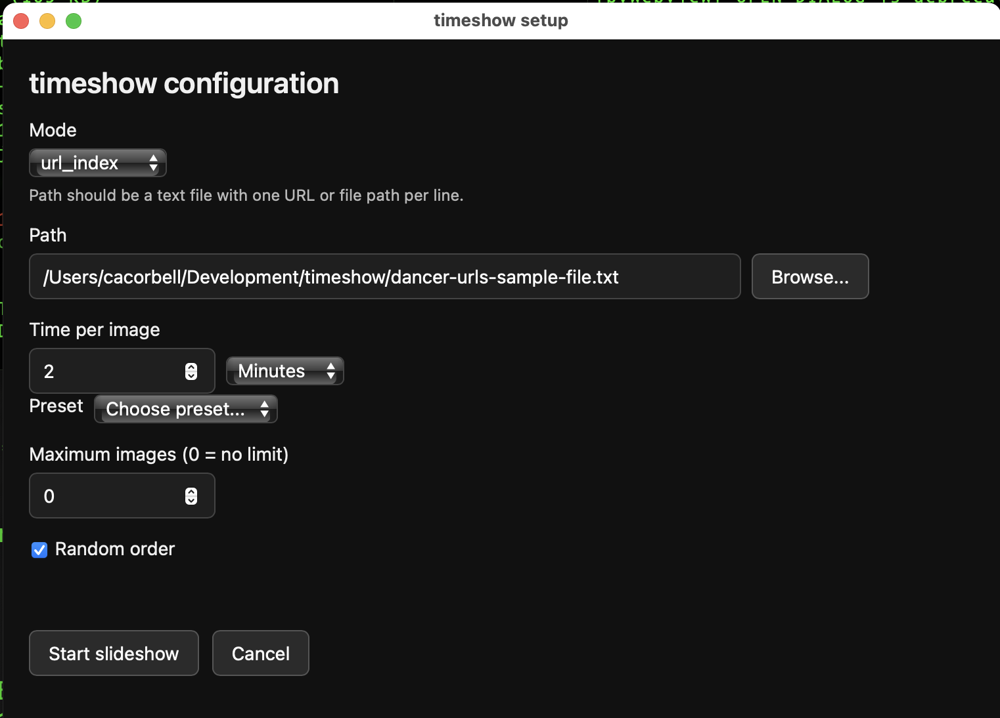
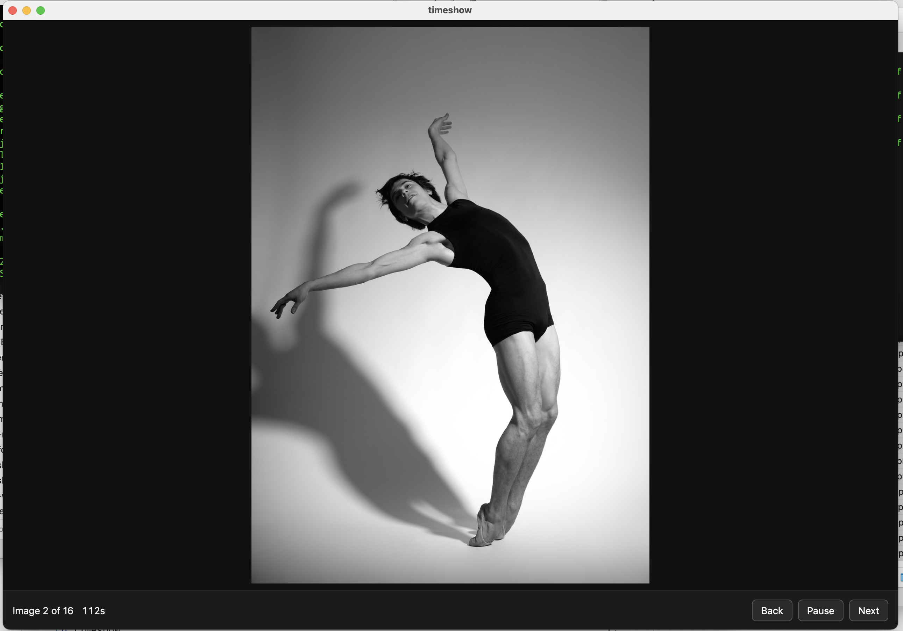

# timeshow

Simple timed slideshow tool for artist reference practice.

**Version:** 1.1\
**Author:** C. A. Corbell\
**License:** MIT\
**Source:** https://github.com/ccorbell/timeshow

## Requirements and Setup

Your system must have Python 3 installed to run this program.

Clone or unzip the timeshow source to the directory where you want to keep it.

Use a Terminal application (macOS / Linux) or Command Prompt (Windows) to launch timeshow using a script in the `timeshow/bin` folder.

If you want to run the script from anywhere, add the `timeshow/bin` directory to your shell or system `PATH`.

## Running timeshow

To run timeshow from Terminal or Command Prompt, invoke the appropriate script in `timeshow/bin`:

**macOS / Linux**
```bash
cd timeshow
bin/timeshow.sh
```

**Windows**
```bat
cd timeshow
bin\timeshow.cmd
```

On first run, the launcher script creates a Python virtual environment in `timeshow/.venv` and installs dependencies from `requirements.txt`.

When you run the program with no arguments, a configuration dialog appears so you can choose the image source and slideshow settings.

### Command-line arguments

```
mode=<shallow_dir|deep_dir|url_index> path=<file-or-directory> [time=<seconds>] [max=<number>] [random=<true|false>]
```

Modes:
- `mode=shallow_dir`: only use image files directly below `path`
- `mode=deep_dir`: recurse through subdirectories of path to find images
- `mode=url_index`: `path` points to a text file with one URL or file path per line; see `dancer-urls-sample-file.txt` for an example

Defaults:
- `time=120` (2 minutes)
- `max=10` (show 10 images; set to 0 for no limit)
- `random=true`
- `mode=shallow_dir`

Optional args:
- `time=90` sets image-display seconds; 120 seconds is the default if omitted
- `max=50` limits how many images are selected; set to 0 for no limit
- `random=false` disables randomization, shows images in order

## UI Controls

- `Back` and `Next` move between images
- `Pause` / `Resume` toggles countdown
- Keyboard: `Space` pause/resume, `Left` previous, `Right` next
- `Export set` (shown in directory modes only) - export the current image set to a text file which can be used to repeat the slideshow

## Screenshots

### Settings window:



### Slideshow:

